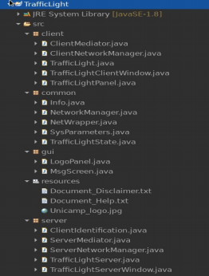
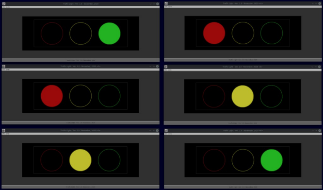

# Projeto III – Controle distribuído de semáforos

Este projeto consiste no desenvolvimento de um programa distribuído para controle de uma rede simulada de semáforos viários como descrito a seguir.

Crie um programa Java distribuído, com interface gráfica construída a partir dos componentes Swing, que consista em dois módulos diferentes: um servidor e um cliente.

O servidor deve coordenar e comandar os semáforos (use um controle temporizado que avance ciclicamente as fases de cada semáforo na ordem: vemelho-verde-amarelo, independentemente), deve permitir que o usuário possa acompanhar online quantos são os semáforos ativos e quais os estados comandados; ao desligar o servidor, todos os semáforos devem ser encerrados. Para efeitos de teste e demonstração, deve haver apenas um servidor ativo na rede e, portanto, o IP e a porta de escuta podem ser fixos para simplificar o trabalho (fixos, mas parametrizados no código e não hard-coded como números mágicos).

O cliente é basicamente um semáforo com as luzes convencionais e deve, ao iniciar, enviar uma mensagem de registro ao servidor; a partir daí, deve receber os comandos de estado (qual luz deve ser acessa) e apresentar a respectiva representação gráfica. Se um semáforo (módulo cliente) for desligado, ele deve comunicar esta ação ao servidor, para que este último pare de enviar comandos a ele. Pode haver um número arbitrário de clientes ativos da rede. Para demonstração do seu trabalho, ative ao menos 4 clientes simultaneamente.

Tanto servidor como cliente devem ter interface gráfica completa, com os respectivos menus (File e Help) e correspondentes ações.

Considere os seguintes pontos:

- são inclusos nesta definição de projeto alguns exemplos de telas do sistema distribuído. Não é necessário reproduzí-las exatamente e o grupo tem liberdade para ser criativo e fazer uma interface ainda melhor. No entanto, elas representam o padrão mínimo de qualidade esperada.

- é sugerido o uso do protocolo de transporte UDP neste sistema.

- considere uso de pacotes para diferenciar servidor, cliente, interface comum e recursos comuns. Outros pacotes podem ser usados conforme desejado pelo grupo.

- utilize uma temporização entre 3 e 5 segundos na demonstração do programa (vídeo) para não torná-la aborrecida com longas esperas.

- leve em conta os vídeos disponibilizados pelo professor nos Canais Café Forte Academic Channel e Café Forte Classroom Support (youtube) para instruções adicionais e para conteúdo necessário ao projeto.

- estude o código feito na atividade “siga o mestre” da 9a. semana da disciplina (09 ou 11/11, conforme a turma), pois ele contém vários elementos mandatórios para este trabalho. Se quiser, o grupo pode usar o código visto em aula, adaptando-o ao projeto (não se esqueça de alterar os textos de Ajuda, Aviso Legal e Créditos).

- neste projeto não é mandatório criar a documentação javadoc mas ela será considerada na pontuação se for corretamente realizada (indique no vídeo);

- preste atenção ao que se solicita na entrega do projeto – entregas em desacordo poderão ser, inclusive, desconsidadradas (== nota ZERO).

A entrega do projeto será feita como segue, no Moodle:

- 1 arquivo compactado contendo todo o código fonte ( zip) – SÓ arquivos .java;

- 1 arquivo jar executável do módulo servidor (.jar);

- 1 arquivo jar executável do módulo cliente (.jar);

- 1 arquivo do relatório de contribuição (.pdf);

- 1 listagem com as classes de cada pacote e respectivas responsabilidades (veja exemplo abaixo) (.pdf);

- 1 link para o vídeo de apresentação (direto no campo de texto).

**Entregas sem os 5 arquivos e/ou sem o link no texto serão consideradas incorretas e poderão ser anuladas!**

O vídeo deve ter até 12 minutos com a apresentação do projeto pelo grupo, enumerando os principais desafios encontrados, as soluções adotadas e a arquetetura de classes usada. Mostre o programa rodando em seu vídeo e todos os recursos, incluindo os ativados pelos menus (Ajuda, etc.).

## Exemplos

### E1. Classes e pacotes usados para o projeto (versão do professor)


*seu grupo não precisa, nem deve, fazer igual: use o exemplo para se inspirar*

#### Responsabilidades

- **client.ClientMediator**: controle (modelo MVC) do módulo

- **client.ClientNetworkManager** (deriva de common.NetworkManager): todo tratamento de rede para módulo cliente

- **client.TrafficLight**: partida do módulo cliente

- **client.TrafficLightClientWindow**: janela gráfica do módulo cliente

- **client.TrafficLightPanel**: área de desenho do semáforo

- **common.Info**: informações do sistema e recuperação de textos de ajuda e correlatos

- **common.NetworkManager**: rotinas comuns (usadas no cliente e no servidor) de tratamento de rede

- **common.NetWrapper**: empacota os comandos num objeto transferido pela rede (facilita muito o trabalho)

- **common.SysParameters**: parâmetros de operação (endereço do servidor, porta de rede, temporização, tamanho de buffer)

- **common.TrafficLightState**: enumeração para os estados do semáforo (inclui estados para registro e finalização)

- **gui.LogoPanel**: painel para logotipo da Unicamp nas telas ativadas pelo menu Help (troque por foto do grupo se preferir)

- **gui.MsgScreen**: tela de mensagem comum a todos os casos ativados pelo menu Help

- **resources**: arquivos de texto e imagem usados por todos os módulos

- **server.ClientIdentification**: informações de controle para cada cliente (IP, porta, estado do semáforo)

- **server.Mediator**: controle (modelo MVC) do módulo

- **server.ServerNetworkManager** (deriva de common.NetworkManager): todo tratamento de rede para módulo servidor

- **server.TrafficLightServer**: partida do módulo servidor

- **server.TrafficLightServerWindow**: janela gráfica do módulo servidor

### E2. Tela do servidor em operação


### E3. Código-fonte (parcial) da classe common.NetworkManager
```java
protected Object deserialize(DatagramPacket incomingPacket) throws IOException, ClassNotFoundException
{
  return (new ObjectInputStream(new ByteArrayInputStream(incomingPacket.getData()))).readObject();
}

protected byte[] serialize(Object obj) throws IOException
{
  ByteArrayOutputStream byteArrayOutputStream = new ByteArrayOutputStream();
  (new ObjectOutputStream(byteArrayOutputStream)).writeObject(obj);
  return (byteArrayOutputStream.toByteArray());
}
```

### E4. Tela do cliente em operação (6 instâncias simultâneas)


## Critérios de Avaliação
*Só serão considerados os programas que compilem sem erro e executem corretamente a(s) funcionalidade(s) requerida(s).*

|    | Item                                                                                                                                      | Max. pontos |
|----|-------------------------------------------------------------------------------------------------------------------------------------------|-------------|
| 01 | Entrega completa de todos os ítens solicitados (número de arquivos e conteúdo solicitado)                                                 |     1,0     |
| 02 | Arquitetura de classes e pacotes (estruturação. divisão de responsabilidades)                                                             |     1,5     |
| 03 | Qualidade do código (estilo. indentação. organização. limpeza)                                                                            |     0,5     |
| 04 | Qualidade e consistência de interface gráfica                                                                                             |     1,0     |
| 05 | Demonstração do programa em execução em 2 ou mais estações simultaneamente                                                                |     1,0     |
| 06 | Adequação do vídeo de apresentação (objetivo. tempo. conteúdo)                                                                            |     1,5     |
| 07 | Clareza na demonstração de desafios. soluções, funcionalidades e metodologia de trabalho                                                  |     0,5     |
| 08 | Bônus para servidor que visualizes graficamente o status de todos os semáforos ativos\*                                                   |     1,0     |
| 09 | Bônus para metodologia de desenvolvimento padronizada (apenas se o grupo indicar no vídeo como ela foi usada e como colaborou no projeto) |     0,5     |
| 10 | Aspecto geral do trabalho                                                                                                                 |     1,5     |
| .. | Total                                                                                                                                     |    10,0     |

\* *(a indicação por meio de texto é o padrão e não conta para o bônus)*
